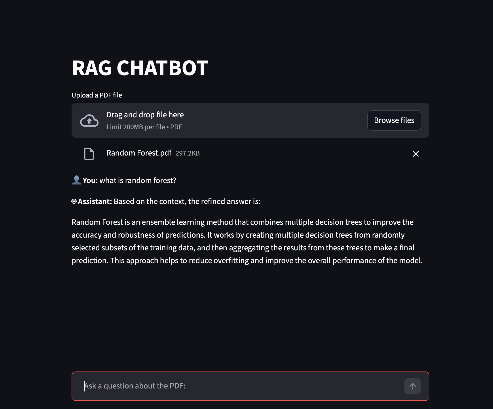
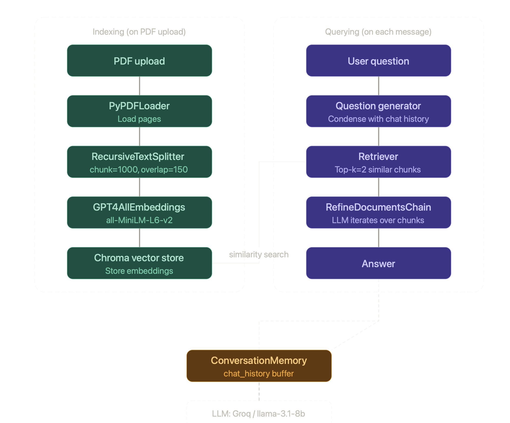

# RAG Chatbot
 
A conversational PDF question-answering chatbot built with LangChain, Groq (LLaMA 3), and Streamlit. Upload any PDF and ask questions about it — the bot remembers your conversation history and refines answers using retrieved document chunks.
 
---
 
## Demo
 
<p align="center">
  
</p>
 
---
 
## How it works
 
The pipeline has two phases:
 
**Indexing** (runs once on PDF upload)
1. PDF is loaded with `PyPDFLoader`
2. Split into chunks (size=1000, overlap=150) via `RecursiveCharacterTextSplitter`
3. Embedded using `GPT4AllEmbeddings` (all-MiniLM-L6-v2)
4. Stored in a `Chroma` vector database
**Querying** (runs on every message)
1. User question + chat history → condensed into a standalone question via `LLMChain`
2. Condensed question → top-2 similar chunks retrieved from Chroma
3. Chunks fed into a `RefineDocumentsChain` — LLM iterates over chunks to build a refined answer
4. Answer + history stored in `ConversationBufferMemory`

<p align="center">
  
</p>
---
 
## Tech stack
 
| Component | Library |
|---|---|
| UI | Streamlit |
| LLM | Groq API (llama-3.1-8b-instant) |
| Embeddings | GPT4All (all-MiniLM-L6-v2) |
| Vector store | Chroma |
| PDF loader | LangChain PyPDFLoader |
| Chains | LangChain Classic |
 
---
 
## Project structure
 
```
rag_chatBot/
├── app.py           # Streamlit UI
├── LC_helper.py     # LangChain pipeline (indexing + chain setup)
├── .env             # API keys (not committed)
├── requirements.txt
└── README.md
```
 
---
 
## Setup
 
### 1. Clone the repo
 
```bash
git clone https://github.com/your-username/Rag-ChatBot.git
cd Rag-ChatBot
```
 
### 2. Create and activate a conda environment
 
```bash
conda create -n nlp python=3.10
conda activate nlp
```
 
### 3. Install dependencies
 
```bash
pip install -r requirements.txt
```
 
### 4. Add your Groq API key
 
Create a `.env` file in the project root:
 
```
GROQ_API_KEY=gsk_your_key_here
```
 
Get a free key at [console.groq.com/keys](https://console.groq.com/keys).
 
### 5. Run the app
 
```bash
streamlit run app.py
```
 
---
 
## Requirements
 
```
streamlit
langchain-classic
langchain-groq
langchain-community
langchain-text-splitters
gpt4all
chromadb
pypdf
python-dotenv
```
 
> The GPT4All embedding model (`all-MiniLM-L6-v2.gguf2.f16.gguf`) will be downloaded automatically on first run.
 
---
 
## Usage
 
1. Upload a PDF using the file uploader
2. Ask any question about the document in the chat input
3. The bot answers using only the content of the PDF, with memory of previous turns
---
 
## Notes
 
- The vector store is rebuilt in memory each time a new PDF is uploaded — there is no persistence between sessions by default
- The refine chain makes multiple LLM calls (one per retrieved chunk), so responses may be slightly slower than a stuff chain but are more thorough
- Chat history is stored in Streamlit session state and resets on page refresh
---
